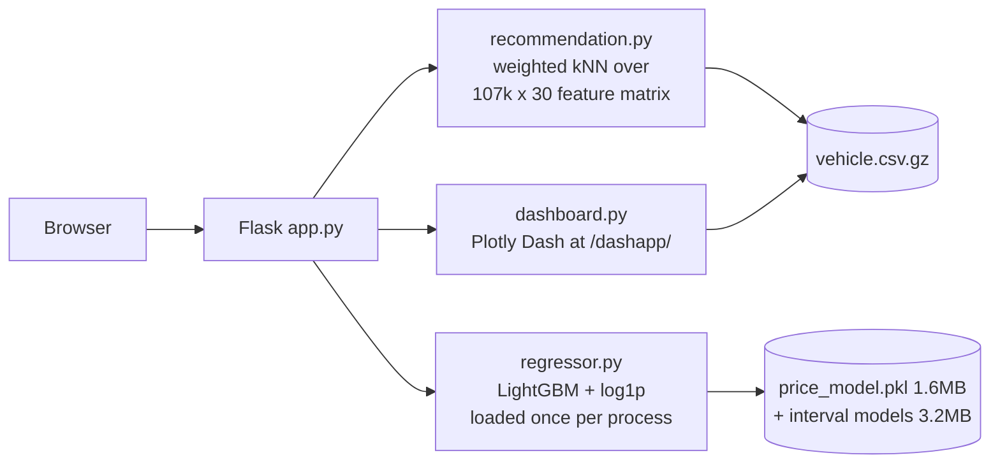

# UK Used Car Price Prediction & Recommendation

[](https://github.com/wanghuirudata/car-recommendation/actions/workflows/tests.yml)

A Flask application over **107,343 UK used-car listings** that does three things:
predicts a fair price for a given spec, recommends comparable vehicles, and
exposes the market data through an interactive BI dashboard.

**Held-out accuracy: MAE £1,068 / MAPE 6.7% / R² 0.963** on a 20% test split.

---

## Why build this

A used-car listing site has one job: get a buyer from "I need a car" to a
specific listing they trust. Two things block that, and both are addressable
with the data a dealer already has.

**Buyers cannot tell whether a price is fair.** Every listing is a number with no
context. A model trained on 107,343 comparable sales turns that into "£11,224,
and cars like this trade between £9,872 and £12,396" — the range matters as much
as the estimate, because it tells the buyer how much the number can be trusted.

**Browsing does not converge.** Filters return thousands of rows sorted by one
column. What moves a buyer forward is a short list of genuine alternatives: the
same class of car from a different maker, or the same car for less money. Both
recommendation tracks exist for that reason, and "at least 5% cheaper" is a
concrete decision, not a similarity score.

The commercial case for recommendation in retail is well established — it is a
standard revenue lever at Amazon and Netflix — and it is far less developed in
used-car marketplaces than in general e-commerce. That gap is the opportunity
this project targets.

Three paths follow from that:

| User | Path |
|---|---|
| **Selling** | Enter a spec → a defensible price with an interval |
| **Buying** | Search, compare, get alternatives, ask the assistant in plain language |
| **Operator** | Dashboard over brand mix, price distribution and depreciation |

Everything below is about whether each of those actually works, and how well.

**[Project presentation](https://prezi.com/p/9bmdq4kidgvo/)** (French) covers the
same framing and the model comparison as originally delivered. Treat this README
as the current record where the two differ: the accuracy figures here come from a
later model, and the chatbot section explains why the assistant ended up on
function calling rather than the retrieval design first sketched.

---

## What it does

| Route | Feature |
|---|---|
| `/purchase` | Enter a spec (year, mileage, fuel, brand…) → predicted market price |
| `/sales` | Search + filter + paginate listings, with recommendations |
| `/vehicle/<id>` | Listing detail, plus two recommendation tracks (see below) |
| `/dashapp/` | Plotly Dash dashboard: brand mix, price distribution, price-by-year |
| `/login`, `/dashboard` | Session-based admin area |
| `/api/chat` | Assistant that answers questions against the dataset (see below) |

## Architecture



Both the feature matrix and the model are built once at process start, so a
request does no disk I/O and no preprocessing.

---

## The data

107,343 listings, nine brands, 192 distinct models. Figures are in `graphic/`,
produced by `model/car-uk.ipynb`.

**The target is right-skewed, and the raw data was capped.** Price runs
£450–£50,000 with a median of £14,500 and a skew of **1.15**. The pre-cleaning
distribution (`graphic/target0.PNG`) ran to £160,000 with a long thin tail; the
working dataset (`graphic/target1.PNG`) is capped at £50,000. `log1p` pulls the
skew to **−0.31**, which is what makes the log-space fit reasonable rather than
merely convenient.

Prices are concentrated in the middle: 65% of listings fall between £7,500 and
£20,000, and only 7% exceed £30,000. That thin top band is exactly where the
error analysis later found the model weakest — there is little to learn from.

**Correlations with price** (`graphic/heatmap.PNG`):

| Feature | r |
|---|---|
| `engineSize` | +0.58 |
| `year` | +0.53 |
| `mileage` | −0.45 |
| `tax` | +0.33 |
| `mpg` | −0.27 |

`year` and `mileage` correlate at **−0.74** — older cars have covered more
ground. For a linear model that collinearity would need handling; gradient
boosting splits on whichever is more useful at each node, so it is left alone.

**One feature is redundant.** `High_Performance` and `Car_Type == 'Performance'`
agree on **99.9%** of rows (φ = 0.91): 326 rows versus 375. The heatmap shows it
as the one bright off-diagonal cell. The model confirms it — `High_Performance`
carries **0.1%** of LightGBM's gain, the lowest of any feature. It is kept
because removing it changes nothing measurable, but it is not doing work.

**Missing data is encoded two ways.** `tax` and `mpg` are absent for the same
9,306 rows (8.7%) as `NaN`, median-imputed inside the pipeline so the imputation
fits on training folds only. `engineSize` instead uses **0** as its missing
marker — 285 rows (0.3%) — which the imputer does not catch, so those rows train
on a physically impossible engine.

### How much accuracy is left in these features?

MAPE 6.7% raises the obvious question: is the model underfitting, or has it
extracted what the recorded columns contain? That is answerable rather than a
matter of opinion.

If two listings are identical on **every recorded feature**, any model must give
them the same prediction — so the spread in their actual prices is error no
algorithm can remove. Grouping by all categorical features, `year`, `engineSize`
and mileage to the nearest 5,000 gives 12,040 such groups covering **89% of the
dataset**. `python analysis/noise_floor.py`:

| | MAPE |
|---|---|
| Noise floor of the current features | **6.0%** |
| What the model achieves | 6.7% |
| **Headroom left in modelling** | **0.7 points** |

**About 90% of the remaining error is not a modelling problem.** Better
algorithms, more tuning, or a bigger ensemble can win at most ~0.7 points; the
rest is variance the recorded columns cannot express.

The extreme cases make it concrete. The widest group is six 2017 Ford Focus
listings — identical fuel, transmission, engine size, body type and mileage —
priced at £12,410, £12,790 and **£38,015**. A £38,000 Focus is a Focus RS; the
data has no column that says so. Similar £23,000–£25,000 gaps appear inside
single groups of BMW 1 Series, Mercedes A Class and BMW 4 Series.

The floor also rises with price — 5.7% under £12,500, **7.6% above £30,000** —
because expensive cars are where unrecorded specification varies most.

**What would actually move the number**, roughly in order of expected value:

| Missing feature | Why it matters here |
|---|---|
| **Trim / spec level** | The Focus RS case; the single largest unexplained gap |
| **Condition & history** | Accident record, service history, MOT status, owner count |
| **Optional extras** | Nav, leather, panoramic roof — thousands of pounds on premium brands |
| **Listing date** | There is no date column at all, so market drift is invisible |
| **Seller type & region** | Dealer vs private, and UK regional price variation |

This reframes the roadmap: the next meaningful accuracy gain comes from
**collecting different data**, not from a better model on this data.

---

## Price model

`price` is right-skewed (£450–£50,000, skew 1.15), so the target is fit in
**log space** (`log1p` / `expm1`). Optimising squared error on raw pounds lets
expensive cars dominate the loss and systematically over-prices cheap ones.

The headline metric is **MAPE**, not RMSE: a buyer perceives "the estimate was
8% off", not "the estimate was £1,800 off".

Reproduce with `python train_model.py --benchmark`:

| Model | MAE | MAPE | RMSE | R² | fit |
|---|---|---|---|---|---|
| Baseline (predict median) | £6,361 | 46.4% | £8,582 | −0.053 | 0.2s |
| Ridge regression | £2,041 | 14.4% | £2,853 | 0.884 | 0.4s |
| RandomForest (100 trees, unbounded) | £1,103 | 7.1% | £1,691 | 0.959 | 21.6s |
| LightGBM (raw target) | £1,070 | 6.9% | **£1,565** | **0.965** | 1.9s |
| **LightGBM + log1p target** ← shipped | **£1,068** | **6.7%** | £1,601 | 0.963 | 1.9s |

**On the trade-off:** raw-target LightGBM wins on MAE/RMSE/R²; the log-target
version wins on MAPE. Since relative error is the metric users actually feel,
the log version ships — and the cost of that choice (£2 of MAE, 0.002 of R²)
is stated rather than hidden.

Replacing RandomForest also shrank the artefact from **874 MB to 1.6 MB (546×)**,
which is what makes the model committable to git and deployable on a free tier
at all.

Top drivers (LightGBM gain): **`model` name 22.9%**, `mpg` 19.0%, `mileage`
16.1%, `year` 12.2%, `engineSize` 8.7%, `Brand` 6.2%. The model name being the
single strongest signal is the point of the next section.

### Error analysis — and the feature it found

`python analysis/error_analysis.py` breaks the held-out errors down instead of
reporting one number. It **retrains on the 80% split** rather than loading the
shipped pickle: that model is fitted on all rows, because serving should use
every row, so scoring it against the "held-out" set leaks. The first version of
the script did exactly that and reported an optimistic 6.7% against a true 7.2%.

Where the model was weak (at MAE £1,164 / MAPE 7.2%, bias −0.1%):

| Segment | MAPE | Within 10% |
|---|---|---|
| Cars over 10 years old | **22.3%** | 34% |
| Mileage 60–100k | 10.1% | 62% |
| Under £7,500 | 10.0% | 64% |
| BMW / Audi / Mercedes | 7.6–7.9% | ~72% |
| Toyota | 6.4% | 79% |

Bias was ≈0 everywhere, so the model was well calibrated but imprecise at the
edges. The largest errors told a sharper story — nearly all were severe
*under*-predictions of expensive cars:

| Car | Actual | Predicted |
|---|---|---|
| BMW **i8** (1.5 L hybrid supercar) | £48,898 | £24,380 |
| Audi **R8** | £47,995 | £27,348 |
| VW **Caravelle** | £43,990 | £22,481 |

One cause: the feature set had `Brand`, `Car_Type` and `engineSize` but **not the
model name**, so an i8 and a 1 Series were indistinguishable. Within a single
(Brand, Car_Type, engineSize) group, prices span up to **£48,645**.

The column was in the data the whole time. It was added in Nov 2024 so listings
could show a car's name, and the fix that made `FEATURE_COLUMNS` an explicit
whitelist — written to keep `image_url`, added the same day, out of training —
locked it out along with it. A correct fix that created a blind spot; only
measurement found it.

`python analysis/feature_experiment.py` tests the change on the same split:

| | MAE | MAPE | R² | Within 10% | Off by >30% |
|---|---|---|---|---|---|
| Without model name | £1,164 | 7.2% | 0.956 | 74.9% | 0.9% |
| **With model name** | **£1,068** | **6.7%** | **0.963** | **78.5%** | **0.6%** |

An 8.2% MAE reduction and a third fewer catastrophic errors, from a column that
was already sitting in the CSV.

**It does not fix everything.** The i8 is still under-predicted at ~£30,000
against a ~£48,900 market price: there are six of them in 107,343 rows. That is a
data-volume limit, not a modelling one, and no feature will fix it.

### Prediction intervals

A bare point estimate claims a confidence the model does not have. Every
estimate now ships with a range, from two extra LightGBM models fitted with the
**pinball loss** at the low and high quantiles. The target stays log-transformed:
quantiles are invariant under a monotonic transform, so `expm1` of the log-space
q90 *is* the price-space q90 — exact, not an approximation.

**Nominal coverage is not measured coverage.** Quantile regression carries no
calibration guarantee, and this model under-covers by a consistent ~4 points:

| Nominal | Measured | Median width |
|---|---|---|
| 80% | 76.3% | £2,727 |
| **85%** ← used | **81.3%** | £3,123 |
| 90% | 86.4% | £3,642 |
| 95% | 92.1% | £4,560 |

So the shipped "80% interval" is built from the **85%** quantile pair, which
measures 81.3% on held-out data. Reproduce with
`python analysis/prediction_intervals.py`.

**The width is itself the signal.** It ranges from 13% of the estimate at the
narrowest decile to 29% at the widest, and tracks exactly the segments the error
analysis flagged:

| | Point estimate | Interval | Relative width |
|---|---|---|---|
| 2018 Ford Fiesta, 30k miles | £11,224 | £9,872–£12,396 | 22% |
| 2017 BMW i8, 36k miles | £28,772 | £15,434–£29,190 | **48%** |
| Cars over 10 years old | — | — | **52%** |

The i8 is the case the point estimate gets wrong, and the interval is the model
saying so. The assistant surfaces this in words — asked about the i8 it replies
that "the wide range reflects that the i8 is a specialist hybrid sports car with
relatively few comparable sales in the dataset."

If the interval models are missing, `car_price_interval` returns the point
estimate with `None` bounds rather than failing — the same degrade-don't-die
rule the assistant follows.

---

## Recommendations

Two tracks on the detail page:

- **Similar Vehicles** — comparable spec, different models
- **Better Value Alternatives** — similar spec, at least 5% cheaper

### Design decisions

**Price is not a similarity feature.** Price is an *outcome* of a car's
attributes, not an attribute. Including it collapses the recommendations into
"other listings at the same price" — the original implementation returned the
same brand, model, year *and* price three times over, i.e. the same car listed
three times. Price is instead used as a **candidate filter** (±40% band), because
someone viewing a £10,000 car is not a buyer for a £23,000 one.

**Weighted euclidean distance, not cosine.** Numeric features are z-scored, so
they are signed; an uncentred cosine over that space has weak geometric meaning.
Euclidean distance with explicit weights is interpretable: numeric distance is
measured in standard deviations, and a differing categorical value contributes a
fixed `sqrt(2) × weight`. The weights (`Brand` 2.0, `Car_Type` 2.0, `year` 1.0,
`mileage` 1.0 …) are a **hand-set cold-start prior** — with click/enquiry
telemetry they should be learned via learning-to-rank.

**Deduplicated by (Brand, model) within the nearest 10,000 candidates.** Pool
size was chosen by measuring, not guessing — over 200 random seed vehicles:

| pool | distinct models (of 3) | median \|Δprice\| | p95 \|Δyear\| | ms/query |
|---|---|---|---|---|
| 100 | 2.04 | £1,166 | 1 | 14.0 |
| 300 | 2.23 | £1,222 | 1 | 14.3 |
| 3,000 | 2.62 | £1,540 | 1 | 15.6 |
| **10,000** | **2.95** | **£1,920** | **1** | **17.1** |
| 30,000 | 3.00 | £1,995 | 1 | 22.9 |
| full table | 3.00 | £1,993 | 1 | 40.9 |

Deduplicating against the *whole* table pushes the third slot far away (a 2015
Fiesta was matched with a 2019 £23,000 Puma). Truncating first keeps results both
diverse and genuinely comparable.

**Result**, measured over the same 200 random seed vehicles by replaying the
original ranking against the current one:

| | distinct models (of 3) | median \|Δprice\| | p95 \|Δprice\| | ms/query |
|---|---|---|---|---|
| Before | 1.16 | £296 | £1,759 | 15.1 |
| After | **2.91** | £1,602 | £7,116 | 19.9 |

The £296 median is the clearest symptom of the original design: the three
"recommendations" were the same car, relisted. The new numbers look worse on
paper — larger price deltas — which is the point. Recommending a genuinely
different vehicle *should* move the price.

**The matrix that could not exist.** The original implementation built a full
pairwise similarity matrix with dask. At 107,343 rows that is 107,343² entries —
**86 GB** at `pairwise_distances`' float64 output, and the cast to `float32`
happens *after* the allocation, so the peak is the full 86 GB either way. It also
ranked by *distance* in descending order, which selects the least similar cars.
Chunking and precomputing into a datastore were both considered; neither fixes
the underlying arithmetic.

A single query never needed the matrix. One row against the table is 107,343 × 30
operations — **17.5 ms**, no precomputation, no storage. At this scale an exact
scan is simply the right call; an ANN index (hnswlib/faiss) only starts paying
for itself around 10⁶+ rows, and would add a dependency and an index-rebuild step
for no current gain.

---

## Assistant

A chat widget that answers questions against the dataset rather than from a
language model's memory — "automatic BMW under £20k", "what's a 2018 Fiesta with
30k miles worth", "anything similar but cheaper". The three existing capabilities
are exposed as tools:

| Tool | Backed by |
|---|---|
| `search_vehicles` | Filter over the in-memory DataFrame |
| `estimate_price` | The LightGBM model above |
| `find_alternatives` | The recommender above |

**Two modes, one implementation.** With `ANTHROPIC_API_KEY` set, Claude decides
which tool to call and how to phrase the answer; tools still execute locally, so
the model never sees the raw dataset. Without a key it falls back to a keyword
and regex parser over the same tools. The fallback is the point: the demo has no
external account to expire and no per-message cost, so it cannot go dark.

**The fallback reports why it fired.** `/api/chat` returns `fallback_reason` —
`no_api_key`, `package_missing`, or `api_error`, and `null` on the LLM path. This
was added after the fallback cost real debugging time: `mode: "rules"` said the
assistant had degraded but not what caused it, and three distinct failures
converged silently on one response. The actual cause was a missing dependency,
indistinguishable from the outside from an unset key.

That is the failure mode of graceful degradation in general, and this repo has
the same bug twice: the recommender's `except` clause returned random vehicles,
turning an outage into "the recommendations aren't very good" (see *How the
similarity feature matrix decayed*). A fallback that hides its own reason isn't
resilience — it's a fault wearing a disguise.

**This is function calling, not RAG.** The distinction matters because the data
decides it. RAG retrieves unstructured *text* by embedding a query and the corpus
into the same vector space and taking the nearest chunks. This dataset is a
107,343-row table, and "automatic diesel SUV under £20,000" is a set of exact
predicates — `transmission = Automatic`, `price <= 20000` — not a fuzzy match.
Semantic similarity is the wrong instrument for a numeric bound: it would happily
return a £26,000 car for being *about* that price. So the model's job here is to
translate intent into typed arguments, and the query itself runs as ordinary
code.

Vector retrieval does appear in this project — in the recommender, as weighted
nearest-neighbour search over a 107,343 × 30 feature matrix. That is the same
mechanism RAG's retrieval half uses, over hand-designed and hand-weighted
features rather than learned text embeddings. RAG would be the right choice here
only if the listings carried free text — condition notes, reviews, spec sheets —
and they don't.

**Why Haiku and not Opus.** The job is intent recognition, picking one of three
tools, and restating a JSON result in a sentence or two — no multi-step
reasoning, no long context, no planning. That is what the small model is for; the
frontier model costs roughly 5× more for no difference a user would notice. This
is the same call as choosing LightGBM over a neural network for a 107k-row
tabular problem: take the one that is sufficient, and be able to say why.

Measured, not assumed. The same four queries — covering all three tools, in
English and Chinese — were run through both models against the live API:

| | Correct tool | Tokens in / out | Cost | Latency |
|---|---|---|---|---|
| **Haiku 4.5** ← shipped | **4 / 4** | 18,001 / 1,531 | **$0.026** | **15.6 s** |
| Opus 5 | 4 / 4 | 14,262 / 2,134 | $0.125 | 46.0 s |

**Identical tool selection, for 4.9× the cost and 2.9× the latency.** Every
query resolved to the right tool on both models, with filters intact and the
answer returned in the language it was asked in:

| Query | Tool |
|---|---|
| "automatic BMW under 20k" | `search_vehicles` — 1,934 matches |
| "2018 年的福特嘉年华跑了 3 万英里值多少钱" | `estimate_price` — £12,899, volunteered with the model's ~7% error band |
| "有没有配置差不多但更便宜的？车辆 id 是 50000" | `find_alternatives` — three cheaper same-year Mercedes |
| "family car, 5 seats, diesel, budget 18000, automatic" | `search_vehicles` — an under-specified brief mapped onto four filters |

Four queries is a spot check, not a benchmark. But the claim being tested was
narrow — *is the small model sufficient for this task* — and on that the answer
is unambiguous.

This replaced a third-party Chatbase embed. On that plan agents are deleted
after 14 days of inactivity, and the embedded bot ID had indeed been reaped —
the script loaded fine and the API returned 404, so the widget silently rendered
nothing. A `<script>` tag also demonstrates nothing; tool-calling over your own
data does.

Two behaviours worth noting, both found by testing rather than by design:

- Search sorts by **newest, then lowest mileage** — not by price ascending.
  "Under £15,000" is a budget ceiling, not a request for the cheapest thing in
  the dataset; sorting by price put a 2003 Focus with 177,000 miles at the top.
- Results are filtered to plausible years (1990–2025). Three rows carry
  impossible values — a Fiesta listed as 2060 and two 1970 cars, one of them a
  Zafira, a model launched in 1999. Three rows in 107,343 do not affect the
  model, but "newest first" put them on screen immediately. They are filtered at
  the presentation layer, leaving the dataset and every measured metric intact.

---

## Quick start

```bash
pip install -r requirements.txt
```

```bash
python app.py
```

Then open <http://localhost:5000>. The trained model (`model/price_model.pkl`,
1.6 MB) is committed, so no training step is needed.

To retrain and re-run the benchmark:

```bash
python train_model.py --benchmark
```

Configuration is via environment variables — all optional for local use:

| Variable | Default | Purpose |
|---|---|---|
| `SECRET_KEY` | random per process | Flask session signing |
| `ADMIN_USERNAME` / `ADMIN_PASSWORD` | `admin` / `admin123` | Demo login |
| `ANTHROPIC_API_KEY` | unset | Enables the assistant's LLM mode; without it the rule-based fallback runs |
| `FLASK_DEBUG` | off | Set to `1` for local debugging |
| `PORT` | 5000 | HTTP port |

---

## Tests

```bash
pip install -r requirements-dev.txt && pytest tests/ -q
```

58 tests, ~6 seconds. They run in the assistant's rule-based mode — `conftest.py`
strips `ANTHROPIC_API_KEY`, so the suite never calls a paid API and never depends
on the network. CI runs on every push; the dataset and the 1.6 MB model are both
committed, so there is no training step in the pipeline.

Almost every test corresponds to a defect that actually occurred, rather than to
a coverage target: regex metacharacters in the search box, an empty result set,
an out-of-range vehicle id, string columns poisoning the similarity matrix, the
three distinct fallback causes.

**The suite was checked by breaking the code on purpose.** A passing test says
nothing until you know it can fail, so seven previously-fixed bugs were
reintroduced one at a time to see whether the tests noticed:

| Reintroduced defect | Caught |
|---|---|
| `price` back into the similarity features | ✅ |
| Price band widened to no-op | ✅ * |
| Implausible-year filter removed | ✅ |
| Search sorted by price ascending again | ✅ |
| Exact-duplicate listings no longer deduplicated | ✅ * |
| Seed vehicle no longer excluded from its own recommendations | ✅ |
| `float32` cast on the feature matrix dropped | ✅ |

\* Caught only after the test was fixed. The first pass missed two of the seven,
and both misses were instructive. The price-band test passed `price_band=0.4`
explicitly, so it verified the parameter worked while ignoring the default —
which is the value the application actually runs on. The de-duplication test used
a query whose results happened to contain no duplicates, so it could not fail.
Neither gap was visible from reading the tests; only breaking the code exposed
them.

The image is platform-neutral: it reads `$PORT`, defaults to 7860, and serves
through waitress. It also **retrains the model during the build** rather than
shipping the committed pickle: the artefact in the repo was produced by Python
3.9 and the image runs 3.11, and regenerating it under the interpreter that will
load it removes a whole class of version-skew failures — while proving the
training pipeline is reproducible from the raw CSV.

Build and run locally with:

```bash
docker build -t ukcar . && docker run --rm -p 7860:7860 ukcar
```

**Hugging Face Spaces** (Docker SDK) — the YAML front matter at the top of this
file is the Space config; push this repo to a Space remote and it builds as-is.

**Render** — `render.yaml` is a blueprint for a free-tier Docker web service.
Note that the free plan sleeps after 15 minutes idle, so the first request after
a quiet period takes roughly a minute.

### Memory

The free tiers are memory-constrained, and this process keeps the full dataset
resident, so footprint was measured rather than assumed:

| | RSS | DataFrame |
|---|---|---|
| Before | 293 MB | 48.8 MB |
| After | 273 MB | **4.0 MB** |
| **In the container** | **178 MB** | 4.0 MB |

Two changes: string columns are cast to `category` (`Brand` has 9 distinct
values, `image_url` 194 — as `object` each row held a separate Python string),
and the Dash app now reuses the DataFrame the Flask app already loaded instead
of reading the dataset a second time. Filtering on `/sales` got about 2×
faster as a side effect.

The rest is interpreter and library import overhead (pandas, scikit-learn,
LightGBM, Dash). The container runs a **single process with 4 threads**
deliberately: multiple workers would each hold their own copy of the dataset
and model.

Verified by running the image under `--memory=512m`, matching the smallest
free tier: **176 MB, 34% of the cap**, all routes serving in under 50 ms. The
in-build retrain reproduces the held-out metrics exactly under Python 3.11
(MAE £1,164 / MAPE 7.2% / R² 0.956), and the same input yields the same
prediction as the local Python 3.9 model to the penny.

---

## Project structure

```
app.py                    Flask routes
dashboard.py              Plotly Dash BI dashboard, mounted at /dashapp/
train_model.py            Training + benchmark CLI
model/regressor.py        Price model: pipeline, log1p target, single load
model/recommendation.py   Feature matrix + two recommendation tracks
model/car-uk.ipynb        EDA and modelling notebook
templates/, static/       Jinja templates and assets
vehicle.csv.gz            107,343 listings (gzipped; pandas reads it directly)
graphic/                  EDA figures from the notebook
```

---

## Engineering notes

The application had several defects that made it unusable; they are documented
here because the fixes are the more interesting part of the work.

| Problem | Fix |
|---|---|
| Similarity silently degraded to **random** recommendations, and on some consoles to a **500**. See the note below. | Build the feature matrix explicitly from named columns as `float32`; keep all log messages ASCII |
| Every prediction re-loaded the 874 MB pickle from disk (~0.8 s/request) | Lazy load once per process behind a double-checked lock (0.05 s cold, 0.01 s warm) |
| Training used every CSV column, so `vehicle_id` / `model` / `image_url` were fed to the model — retraining crashed outright | Single `FEATURE_COLUMNS` constant shared by training and serving |
| `/search` rendered a template that does not exist | Removed — `/sales` already covered it and nothing linked to it |
| `/chatbot` called `request.post()`, which does not exist | Removed — the frontend uses Chatbase's browser embed and never hit the backend |
| Empty search results crashed `np.random.choice` | Guarded; the recommendation block renders empty |
| Regex metacharacters in the search box raised an exception | `str.contains(..., regex=False, na=False)` |
| An 86 GB dask full-similarity matrix, ranked by *distance* in descending order (returning the least similar cars) | Deleted; single-vector scan replaces it |
| Dash referenced `styles.css`; the file is `style.css` | Corrected |
| Hardcoded secret key and admin password | Moved to environment variables |

### How the similarity feature matrix decayed

Worth writing down, because the code never changed — the world around it did,
and the failure was invisible from the outside.

`load_and_prepare_data` originally built its matrix by copying the whole
DataFrame, one-hot encoding the categoricals, and dropping the originals. That
works only while every surviving column is numeric. Two later changes broke
that assumption:

1. **The dataset gained display columns.** `model` and `image_url` were added
   so listings could show a name and a photo. They are strings, they were never
   dropped, and `.values` on a frame containing them yields `object` dtype.
2. **pandas 2.0 changed `get_dummies` to return `bool`** instead of `uint8`.
   Mixing `bool` with `int64` and `float64` is enough on its own to make
   `.values` collapse to `object` — so even the pre-`model`/`image_url` schema
   stops working on a modern pandas.

Either one makes `np.dot` raise. The consequence depended on where it ran:

| | Console encoding | Observed behaviour |
|---|---|---|
| Original 11-column data, pandas 1.x | any | Similarity worked; recommendations were near-duplicates (£296 median price delta) |
| After the schema change | UTF-8 | `except` caught it, printed a message, returned **random** vehicles — the page rendered fine |
| After the schema change | cp1252 | The `print` of a non-ASCII message *itself* raised `UnicodeEncodeError`, escaping the handler → **HTTP 500** |

The fallback handler was the thing that turned a bad recommendation into an
outage, and a non-ASCII log message was what decided which. That is why the
matrix is now built from an explicit column list and cast to `float32`, and why
every runtime message is ASCII.

## Known limitations & roadmap

- **No user telemetry.** There are no view/favourite/enquiry events, so
  `collaborative_filtering_recommendation()` is a documented stub and the
  recommendation weights are a hand-set prior. With event data: item-CF blended
  with the content model for cold start, and Recall@K / CTR as offline metrics.
- **No confidence interval on predictions.** A point estimate of £11,549 without
  a range overstates certainty. Next: quantile regression for a prediction
  interval, plus SHAP attributions ("mileage −£800, year +£1,500").
- **Single-account demo auth.** SHA256 without a salt is fine for a demo login
  but is not a user system; real accounts need `werkzeug.security` (scrypt/bcrypt).
- **CSV as the datastore.** Fine at 107k rows in a single process. Beyond that:
  Postgres, Redis for hot queries, and the model behind its own service.
- **Data quirks.** `tax` and `mpg` are missing for 9,306 rows (8.7%, median-imputed);
  brand naming needed normalisation (`Vauxhall/Opel` → `Vauxhall-Opel`).
