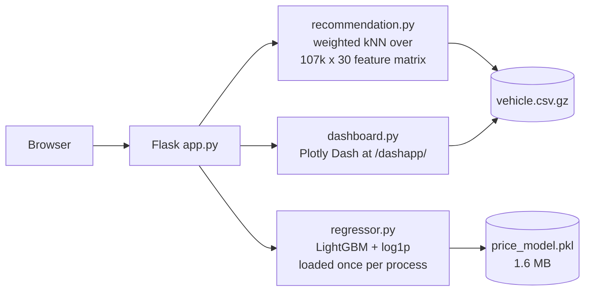

# UK Used Car Price Prediction & Recommendation

A Flask application over **107,343 UK used-car listings** that does three things:
predicts a fair price for a given spec, recommends comparable vehicles, and
exposes the market data through an interactive BI dashboard.

**Held-out accuracy: MAE £1,164 / MAPE 7.2% / R² 0.956** on a 20% test split.

---

## What it does

| Route | Feature |
|---|---|
| `/purchase` | Enter a spec (year, mileage, fuel, brand…) → predicted market price |
| `/sales` | Search + filter + paginate listings, with recommendations |
| `/vehicle/<id>` | Listing detail, plus two recommendation tracks (see below) |
| `/dashapp/` | Plotly Dash dashboard: brand mix, price distribution, price-by-year |
| `/login`, `/dashboard` | Session-based admin area |
| `/api/chat` | Assistant that answers questions against the dataset (see below) |

## Architecture



Both the feature matrix and the model are built once at process start, so a
request does no disk I/O and no preprocessing.

---

## Price model

`price` is right-skewed (£450–£50,000, skew 1.15), so the target is fit in
**log space** (`log1p` / `expm1`). Optimising squared error on raw pounds lets
expensive cars dominate the loss and systematically over-prices cheap ones.

The headline metric is **MAPE**, not RMSE: a buyer perceives "the estimate was
8% off", not "the estimate was £1,800 off".

Reproduce with `python train_model.py --benchmark`:

| Model | MAE | MAPE | RMSE | R² | fit |
|---|---|---|---|---|---|
| Baseline (predict median) | £6,361 | 46.4% | £8,582 | −0.053 | 0.1s |
| Ridge regression | £2,530 | 17.8% | £3,502 | 0.825 | 0.2s |
| RandomForest (100 trees, unbounded) | £1,189 | 7.7% | £1,819 | 0.953 | 6.4s |
| LightGBM (raw target) | £1,153 | **7.4%** | **£1,700** | **0.959** | 2.2s |
| **LightGBM + log1p target** ← shipped | **£1,164** | **7.2%** | £1,745 | 0.956 | 2.3s |

**On the trade-off:** raw-target LightGBM wins on MAE/RMSE/R²; the log-target
version wins on MAPE. Since relative error is the metric users actually feel,
the log version ships — and the cost of that choice (£11 of MAE, 0.003 of R²)
is stated rather than hidden.

Replacing RandomForest also shrank the artefact from **874 MB to 1.6 MB (546×)**,
which is what makes the model committable to git and deployable on a free tier
at all.

Top drivers (LightGBM gain): `mpg` 24.8%, `mileage` 17.3%, `year` 13.0%,
`engineSize` 11.5%, `tax` 7.3% — the rest is brand/body/fuel one-hots.

---

## Recommendations

Two tracks on the detail page:

- **Similar Vehicles** — comparable spec, different models
- **Better Value Alternatives** — similar spec, at least 5% cheaper

### Design decisions

**Price is not a similarity feature.** Price is an *outcome* of a car's
attributes, not an attribute. Including it collapses the recommendations into
"other listings at the same price" — the original implementation returned the
same brand, model, year *and* price three times over, i.e. the same car listed
three times. Price is instead used as a **candidate filter** (±40% band), because
someone viewing a £10,000 car is not a buyer for a £23,000 one.

**Weighted euclidean distance, not cosine.** Numeric features are z-scored, so
they are signed; an uncentred cosine over that space has weak geometric meaning.
Euclidean distance with explicit weights is interpretable: numeric distance is
measured in standard deviations, and a differing categorical value contributes a
fixed `sqrt(2) × weight`. The weights (`Brand` 2.0, `Car_Type` 2.0, `year` 1.0,
`mileage` 1.0 …) are a **hand-set cold-start prior** — with click/enquiry
telemetry they should be learned via learning-to-rank.

**Deduplicated by (Brand, model) within the nearest 10,000 candidates.** Pool
size was chosen by measuring, not guessing — over 200 random seed vehicles:

| pool | distinct models (of 3) | median \|Δprice\| | p95 \|Δyear\| | ms/query |
|---|---|---|---|---|
| 100 | 2.04 | £1,166 | 1 | 14.0 |
| 300 | 2.23 | £1,222 | 1 | 14.3 |
| 3,000 | 2.62 | £1,540 | 1 | 15.6 |
| **10,000** | **2.95** | **£1,920** | **1** | **17.1** |
| 30,000 | 3.00 | £1,995 | 1 | 22.9 |
| full table | 3.00 | £1,993 | 1 | 40.9 |

Deduplicating against the *whole* table pushes the third slot far away (a 2015
Fiesta was matched with a 2019 £23,000 Puma). Truncating first keeps results both
diverse and genuinely comparable.

**Result**, measured over the same 200 random seed vehicles by replaying the
original ranking against the current one:

| | distinct models (of 3) | median \|Δprice\| | p95 \|Δprice\| | ms/query |
|---|---|---|---|---|
| Before | 1.16 | £296 | £1,759 | 15.1 |
| After | **2.91** | £1,602 | £7,116 | 19.9 |

The £296 median is the clearest symptom of the original design: the three
"recommendations" were the same car, relisted. The new numbers look worse on
paper — larger price deltas — which is the point. Recommending a genuinely
different vehicle *should* move the price.

At 107k rows an exact scan is the right call. An ANN index (hnswlib/faiss) only
starts paying for itself around 10⁶+ rows, and would add a dependency and an
index-rebuild step for no current gain.

---

## Assistant

A chat widget that answers questions against the dataset rather than from a
language model's memory — "automatic BMW under £20k", "what's a 2018 Fiesta with
30k miles worth", "anything similar but cheaper". The three existing capabilities
are exposed as tools:

| Tool | Backed by |
|---|---|
| `search_vehicles` | Filter over the in-memory DataFrame |
| `estimate_price` | The LightGBM model above |
| `find_alternatives` | The recommender above |

**Two modes, one implementation.** With `ANTHROPIC_API_KEY` set, Claude decides
which tool to call and how to phrase the answer; tools still execute locally, so
the model never sees the raw dataset. Without a key it falls back to a keyword
and regex parser over the same tools. The fallback is the point: the demo has no
external account to expire and no per-message cost, so it cannot go dark.

**The fallback reports why it fired.** `/api/chat` returns `fallback_reason` —
`no_api_key`, `package_missing`, or `api_error`, and `null` on the LLM path. This
was added after the fallback cost real debugging time: `mode: "rules"` said the
assistant had degraded but not what caused it, and three distinct failures
converged silently on one response. The actual cause was a missing dependency,
indistinguishable from the outside from an unset key.

That is the failure mode of graceful degradation in general, and this repo has
the same bug twice: the recommender's `except` clause returned random vehicles,
turning an outage into "the recommendations aren't very good" (see *How the
similarity feature matrix decayed*). A fallback that hides its own reason isn't
resilience — it's a fault wearing a disguise.

**This is function calling, not RAG.** The distinction matters because the data
decides it. RAG retrieves unstructured *text* by embedding a query and the corpus
into the same vector space and taking the nearest chunks. This dataset is a
107,343-row table, and "automatic diesel SUV under £20,000" is a set of exact
predicates — `transmission = Automatic`, `price <= 20000` — not a fuzzy match.
Semantic similarity is the wrong instrument for a numeric bound: it would happily
return a £26,000 car for being *about* that price. So the model's job here is to
translate intent into typed arguments, and the query itself runs as ordinary
code.

Vector retrieval does appear in this project — in the recommender, as weighted
nearest-neighbour search over a 107,343 × 30 feature matrix. That is the same
mechanism RAG's retrieval half uses, over hand-designed and hand-weighted
features rather than learned text embeddings. RAG would be the right choice here
only if the listings carried free text — condition notes, reviews, spec sheets —
and they don't.

**Why Haiku and not Opus.** The job is intent recognition, picking one of three
tools, and restating a JSON result in a sentence or two — no multi-step
reasoning, no long context, no planning. That is what the small model is for; the
frontier model costs roughly 5× more for no difference a user would notice. This
is the same call as choosing LightGBM over a neural network for a 107k-row
tabular problem: take the one that is sufficient, and be able to say why.

Measured, not assumed. The same four queries — covering all three tools, in
English and Chinese — were run through both models against the live API:

| | Correct tool | Tokens in / out | Cost | Latency |
|---|---|---|---|---|
| **Haiku 4.5** ← shipped | **4 / 4** | 18,001 / 1,531 | **$0.026** | **15.6 s** |
| Opus 5 | 4 / 4 | 14,262 / 2,134 | $0.125 | 46.0 s |

**Identical tool selection, for 4.9× the cost and 2.9× the latency.** Every
query resolved to the right tool on both models, with filters intact and the
answer returned in the language it was asked in:

| Query | Tool |
|---|---|
| "automatic BMW under 20k" | `search_vehicles` — 1,934 matches |
| "2018 年的福特嘉年华跑了 3 万英里值多少钱" | `estimate_price` — £12,899, volunteered with the model's ~7% error band |
| "有没有配置差不多但更便宜的？车辆 id 是 50000" | `find_alternatives` — three cheaper same-year Mercedes |
| "family car, 5 seats, diesel, budget 18000, automatic" | `search_vehicles` — an under-specified brief mapped onto four filters |

Four queries is a spot check, not a benchmark. But the claim being tested was
narrow — *is the small model sufficient for this task* — and on that the answer
is unambiguous.

This replaced a third-party Chatbase embed. On that plan agents are deleted
after 14 days of inactivity, and the embedded bot ID had indeed been reaped —
the script loaded fine and the API returned 404, so the widget silently rendered
nothing. A `<script>` tag also demonstrates nothing; tool-calling over your own
data does.

Two behaviours worth noting, both found by testing rather than by design:

- Search sorts by **newest, then lowest mileage** — not by price ascending.
  "Under £15,000" is a budget ceiling, not a request for the cheapest thing in
  the dataset; sorting by price put a 2003 Focus with 177,000 miles at the top.
- Results are filtered to plausible years (1990–2025). Three rows carry
  impossible values — a Fiesta listed as 2060 and two 1970 cars, one of them a
  Zafira, a model launched in 1999. Three rows in 107,343 do not affect the
  model, but "newest first" put them on screen immediately. They are filtered at
  the presentation layer, leaving the dataset and every measured metric intact.

---

## Quick start

```bash
pip install -r requirements.txt
```

```bash
python app.py
```

Then open <http://localhost:5000>. The trained model (`model/price_model.pkl`,
1.6 MB) is committed, so no training step is needed.

To retrain and re-run the benchmark:

```bash
python train_model.py --benchmark
```

Configuration is via environment variables — all optional for local use:

| Variable | Default | Purpose |
|---|---|---|
| `SECRET_KEY` | random per process | Flask session signing |
| `ADMIN_USERNAME` / `ADMIN_PASSWORD` | `admin` / `admin123` | Demo login |
| `ANTHROPIC_API_KEY` | unset | Enables the assistant's LLM mode; without it the rule-based fallback runs |
| `FLASK_DEBUG` | off | Set to `1` for local debugging |
| `PORT` | 5000 | HTTP port |

---

## Deployment

The image is platform-neutral: it reads `$PORT`, defaults to 7860, and serves
through waitress. It also **retrains the model during the build** rather than
shipping the committed pickle: the artefact in the repo was produced by Python
3.9 and the image runs 3.11, and regenerating it under the interpreter that will
load it removes a whole class of version-skew failures — while proving the
training pipeline is reproducible from the raw CSV.

Build and run locally with:

```bash
docker build -t ukcar . && docker run --rm -p 7860:7860 ukcar
```

**Hugging Face Spaces** (Docker SDK) — the YAML front matter at the top of this
file is the Space config; push this repo to a Space remote and it builds as-is.

**Render** — `render.yaml` is a blueprint for a free-tier Docker web service.
Note that the free plan sleeps after 15 minutes idle, so the first request after
a quiet period takes roughly a minute.

### Memory

The free tiers are memory-constrained, and this process keeps the full dataset
resident, so footprint was measured rather than assumed:

| | RSS | DataFrame |
|---|---|---|
| Before | 293 MB | 48.8 MB |
| After | 273 MB | **4.0 MB** |
| **In the container** | **178 MB** | 4.0 MB |

Two changes: string columns are cast to `category` (`Brand` has 9 distinct
values, `image_url` 194 — as `object` each row held a separate Python string),
and the Dash app now reuses the DataFrame the Flask app already loaded instead
of reading the dataset a second time. Filtering on `/sales` got about 2×
faster as a side effect.

The rest is interpreter and library import overhead (pandas, scikit-learn,
LightGBM, Dash). The container runs a **single process with 4 threads**
deliberately: multiple workers would each hold their own copy of the dataset
and model.

Verified by running the image under `--memory=512m`, matching the smallest
free tier: **176 MB, 34% of the cap**, all routes serving in under 50 ms. The
in-build retrain reproduces the held-out metrics exactly under Python 3.11
(MAE £1,164 / MAPE 7.2% / R² 0.956), and the same input yields the same
prediction as the local Python 3.9 model to the penny.

---

## Project structure

```
app.py                    Flask routes
dashboard.py              Plotly Dash BI dashboard, mounted at /dashapp/
train_model.py            Training + benchmark CLI
model/regressor.py        Price model: pipeline, log1p target, single load
model/recommendation.py   Feature matrix + two recommendation tracks
model/car-uk.ipynb        EDA and modelling notebook
templates/, static/       Jinja templates and assets
vehicle.csv.gz            107,343 listings (gzipped; pandas reads it directly)
graphic/                  EDA figures from the notebook
```

---

## Engineering notes

The application had several defects that made it unusable; they are documented
here because the fixes are the more interesting part of the work.

| Problem | Fix |
|---|---|
| Similarity silently degraded to **random** recommendations, and on some consoles to a **500**. See the note below. | Build the feature matrix explicitly from named columns as `float32`; keep all log messages ASCII |
| Every prediction re-loaded the 874 MB pickle from disk (~0.8 s/request) | Lazy load once per process behind a double-checked lock (0.05 s cold, 0.01 s warm) |
| Training used every CSV column, so `vehicle_id` / `model` / `image_url` were fed to the model — retraining crashed outright | Single `FEATURE_COLUMNS` constant shared by training and serving |
| `/search` rendered a template that does not exist | Removed — `/sales` already covered it and nothing linked to it |
| `/chatbot` called `request.post()`, which does not exist | Removed — the frontend uses Chatbase's browser embed and never hit the backend |
| Empty search results crashed `np.random.choice` | Guarded; the recommendation block renders empty |
| Regex metacharacters in the search box raised an exception | `str.contains(..., regex=False, na=False)` |
| A 46 GB dask full-similarity matrix, ranked by *distance* in descending order (returning the least similar cars) | Deleted; single-vector scan replaces it |
| Dash referenced `styles.css`; the file is `style.css` | Corrected |
| Hardcoded secret key and admin password | Moved to environment variables |

### How the similarity feature matrix decayed

Worth writing down, because the code never changed — the world around it did,
and the failure was invisible from the outside.

`load_and_prepare_data` originally built its matrix by copying the whole
DataFrame, one-hot encoding the categoricals, and dropping the originals. That
works only while every surviving column is numeric. Two later changes broke
that assumption:

1. **The dataset gained display columns.** `model` and `image_url` were added
   so listings could show a name and a photo. They are strings, they were never
   dropped, and `.values` on a frame containing them yields `object` dtype.
2. **pandas 2.0 changed `get_dummies` to return `bool`** instead of `uint8`.
   Mixing `bool` with `int64` and `float64` is enough on its own to make
   `.values` collapse to `object` — so even the pre-`model`/`image_url` schema
   stops working on a modern pandas.

Either one makes `np.dot` raise. The consequence depended on where it ran:

| | Console encoding | Observed behaviour |
|---|---|---|
| Original 11-column data, pandas 1.x | any | Similarity worked; recommendations were near-duplicates (£296 median price delta) |
| After the schema change | UTF-8 | `except` caught it, printed a message, returned **random** vehicles — the page rendered fine |
| After the schema change | cp1252 | The `print` of a non-ASCII message *itself* raised `UnicodeEncodeError`, escaping the handler → **HTTP 500** |

The fallback handler was the thing that turned a bad recommendation into an
outage, and a non-ASCII log message was what decided which. That is why the
matrix is now built from an explicit column list and cast to `float32`, and why
every runtime message is ASCII.

## Known limitations & roadmap

- **No user telemetry.** There are no view/favourite/enquiry events, so
  `collaborative_filtering_recommendation()` is a documented stub and the
  recommendation weights are a hand-set prior. With event data: item-CF blended
  with the content model for cold start, and Recall@K / CTR as offline metrics.
- **No confidence interval on predictions.** A point estimate of £11,549 without
  a range overstates certainty. Next: quantile regression for a prediction
  interval, plus SHAP attributions ("mileage −£800, year +£1,500").
- **Single-account demo auth.** SHA256 without a salt is fine for a demo login
  but is not a user system; real accounts need `werkzeug.security` (scrypt/bcrypt).
- **CSV as the datastore.** Fine at 107k rows in a single process. Beyond that:
  Postgres, Redis for hot queries, and the model behind its own service.
- **Data quirks.** `tax` and `mpg` are missing for 9,306 rows (8.7%, median-imputed);
  brand naming needed normalisation (`Vauxhall/Opel` → `Vauxhall-Opel`).
